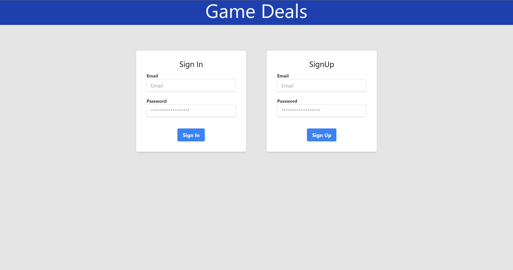
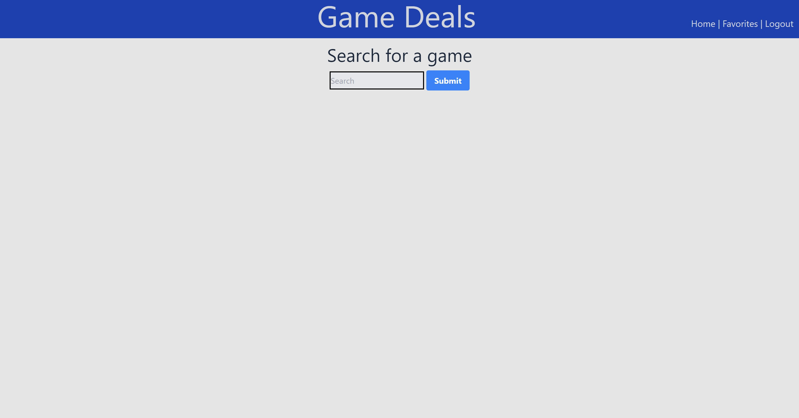
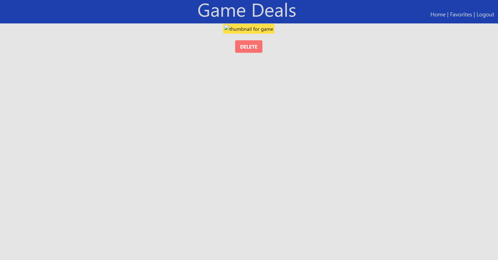

# Game Deals

  ## Table of Contents
  * [Description](#description)
  * [Installation](#installation)
  * [Usage](#usage)
  * [Contribution](#contribution)
  * [Tests](#tests)
  * [Liscense](#liscense)

  ## Description
  This is a website that when you search a game it will find the best deal from three differnt stores, and allows you to favorite games to keep track of them. It uses cheapshark's api to accomplish this. It also requires users to either login in or sign up to use the website. As of right now it only will show you the price for the store, but in the future we want users to be able to click the game and them redricted to the store to buy the game. 
  
  ## Installation
  This website was accomplished using handlebars for the template. It also used Node.js and Express.js to create a RESTful API, and we used MySQL and Sequelize ORM for the database.
  The folder structure is MVC paradigm, and is being deployed by Heroku.

  ## Usage
  To use this website you can go to the live link, and signup or login.

  

  

  

  ## Contribution
  right now there are no contribution guidelines

  ## Tests
  N/A

  ## Liscense
  MIT

